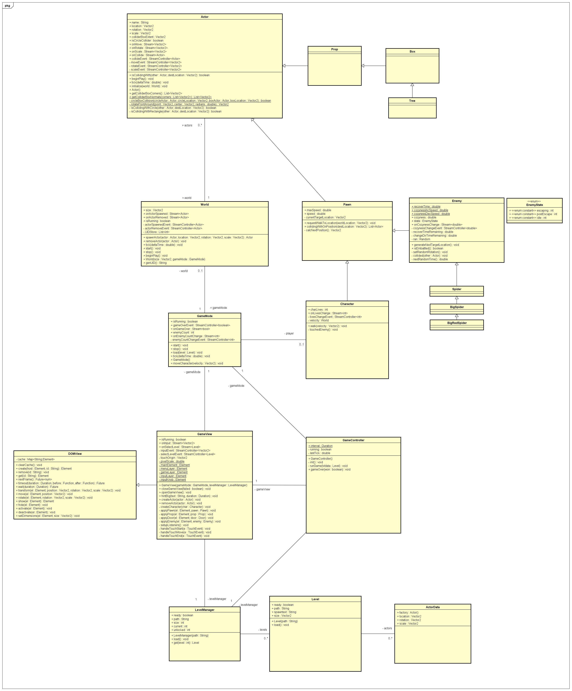

# Australia Simulator

## 1 - Einleitung

Willkommen in Australien.

## 2 - Anforderungen und Konzept

### 2.1 - Anforderungen

#### __AF-1:__ Single-Player-Game als Single-Page-App
_Australia Simulator_ ist ein Singleplayer-Spiel als Single-Page-Application, das in Dart entwickelt wurde.
Alle Assets sind relativ adressiert und es wird kein Backend benötigt. Jeglicher Fortschritt wird direkt im Browser des Users gespeichert und somit kann _Australia Simulator_ statisch vertrieben werden.

#### __AF-2:__ Balance zwischen technischer Komplexität und Spielkonzept

In _Australia Simulator_ muss der Spieler versuchen verschiedene gefährliche Tiere aus seinem Haus zu verscheuchen, ohne dabei die Tiere zu berühren, ansonsten verliert der Spieler ein Leben und hat dieser keine Leben mehr, so hat er verloren.

Die Gegner fliehen also entsprechend vor dem Spieler oder bewegen sich zufällig im Haus.

Mit der Zeit erhöht sich der Wohlfühl-Faktor der Gegner, der Spieler kann diesen aber reduzieren, indem er die Gegner scheucht. Erreicht ein Gegner seinen vollen Wohlfühl-Faktor, so hat der Spieler verloren.

Schafft es der Spieler aber vorher alle Gegner aus dem Haus zu verscheuchen, so hat der Spieler gewonnen und das nächste Level kann geladen werden.

Die gesamte Gamelogik läuft in Echtzeit mit pixel-genauen Positionen und einer zentrierten Kamera über dem Spieler.

#### __AF-3:__ DOM-Tree basiert

_Australia Simulator_ verwendet ein MVC Model, bei dem der DOM-Tree das View darstellt und entsprechend das Spiel rendert und auf events im Model reagiert.

Das Spiel verwendet kein festes Grid in dem Spielobjekte von Zelle zu Zelle verschoben werden können, sondern stattdessen lose Elemente, die benötigt werden für die Spielobjekte und frei in der Spielwelt bewegt und animiert werden können.

Dies hat außerdem zur Folge, dass die HTML Elemente nicht immer komplett geupdated werden müssen, sondern lediglich - sobald benötigt - manipuliert. Mithilfe von ```will-change``` lassen sich Performance-relevante Elemente (z.B. Spielwelt und Gegner) außerdem in ihrer Position verändern, ohne einen Re-Render der HTML Engine zu erzwingen. Das Positionsupdate wird hierbei von der GPU übernommen.

#### __AF-4:__ Target device: Smartphone

_Australia Simulator_ wird eine responsive PWA und somit auf iOS und Android, sowie in modernen HTML5 Browsern gleich funktionieren. Als device-agnostic Eingabemethode haben wir uns eine Touch-and-Move Steuerung ausgedacht, bei der der Spieler mit der Maus oder per Touchscreen irgendwo auf der Karte gedrückt hält und der Character bewegt sich dorthin. Sollte der Spieler wieder los lassen oder von einem Hinderniss blockiert werden bleibt der Character stehen.

Für Desktop bietet sich allerdings darüberhinaus auch noch eine Pfeiltasten Bedienung an.


#### __AF-5:__ Mobile First Prinzip

Für erweiterte UI Interaktionen, wie z.B. das wegdrücken von Modals am Anfang einer Runde bieten sich neben klassischen Eingabearten (Close-Button obere rechte Ecke vom Widget) außerdem Touchscreen Interaktionen an, wie das Wegswipen vom Widget. Da wo es angebracht ist, wollen wir die Interaktionen für Touchscreens vereinfachen.

#### __AF-6:__ Das Spiel muss schnell und intuitiv erfassbar sein und Spielfreude erzeugen

Das gesamte Spiel kann mit nur einer einzigen Eingabemethode gespielt werden und ist entsprechend intuitiv aufzugreifen. Wie viel Spielspaß dieses Spiel am Ende tatsächlich erzeugen kann und wielange das Spiel diesen aufrecht erhalten kann, muss in einem späteren Schritt balanciert werden.

#### __AF-7:__ Das Spiel muss ein Levelkonzept vorsehen

_Australia Simulator_ wird mindestens sieben im Schwierigkeitsgrad aufsteigende Level anbieten, welche extra konfiguriert werden können, wobei die jeweilige Karte in der Größe festgelegt werden kann. Weitere Einstellungsmöglichkeiten für die Level beinhalten: Anzahl der Gegner, Art der Gegner, Geschwindigkeit der Gegner und dem Wohlfühlsfaktor der Gegner, sowie der zugehörigen Steigungsrate.

#### __AF-8:__ Ggf. erforderliche Speicherkonzepte sind Client-seitig zu realisieren

Es ist vorgesehen den Levelfortschritt im localStorage abzuspeichern, damit der Spieler dort weitermachen kann, wo er aufgehört hat. Weitere Daten, wie Einstellungen für das Spiel etc. können ebenfalls im localStorage abgespeichert werden.

#### __AF-9:__ Dokumentation

Gegeben.

### 2.2 - Spielkonzept: Australia Simulator

Das Spiel Australia Simulator ist ein top-down Arcade Game, bei welchem der Spieler versuchen muss, die wilden Tiere aus seinem Haus zu verscheuchen, bevor diese sich einnisten und die Zeit abläuft oder der Spieler von denen verletzt wird. 

Dabei sieht der Spieler seinen Character in der Mitte des Bildschirms und kann sich in einem 360° Radius bewegen, abhängig davon, wohin der Spieler mit dem Finger zeigt. 

Im Haus laufen abhängig vom derzeitigen Level unterschiedlich viele und schnelle Gegner rum, welche - wenn der Spieler zu nah kommt - versuchen werden vor diesem abzuhauen. Das Ziel ist es, alle dieser Gegner aus dem Haus zu vertreiben, bevor sie ihren "Coziness"-Balken auffüllen (sich anfangen heimisch zu fühlen). Hat der Spieler alle Gegner vetrieben, so hat er das Level bestanden und das nächste Level kann geladen werden.

## 3 - Architektur

Australia Simulator folgt der MVC-Architektur, bei der wir Interaktionen und Ausgaben/View vom Model trennen. Entscheidende Rolle spielt hierbei der GameController, da er View und Model erstellt und auf User-Interaktionen und Timern horcht und diese an das Model weiterleitet.

Der GameView ist für DOM-Manipulation vorgesehen, deswegen erstellt er das Spielfeld und horcht auf Model-Events um den DOM-Tree up-to-date zu halten.

Das Model des Spiels besteht aus mehreren Schichten an Klassen und orientiert sich an bekannten Spiele-Engines wie z.B. der Unreal Engine, allerdings sehr stark auf die Bedürfnisse für dieses Projekt zugeschnitten.



### 3.1 - Model

Das Model umfasst das GameMode Entity, eine World Entity, sowie Objekte, welche sich in einem Level befinden und von einer Basisklasse (Actor) erben. Actor enthält die grundlegenden Informationen über ein Spielobjekt (Spielfigur, Teile der Welt, ...), um es in einem Level zu positionieren, sowie Kollision abfragen zu können.

So wird zu Beginn eines Spieles die Welt von dem Gamemode aufgebaut (Architektur / Props, Gegner, Player spawnen). 
Zu jeder Zeit kommuniziert der GameController nur mit dem GameMode, welches das Spiel verwaltet und die Interaktionen der Nutzer an seine Spielfigur weiterleitet.

Während das Spiel läuft werden alle beweglichen Objekte (Spielfiguren) "getickt" (hot loop) um die nötigen Berechnungen zu machen, die für das Spiel benötigt werden (positionsupdate, collision, ...).

Zu einem Levelwechsel wird zuerst das aktuelle Level gecleared und dann durch eine neue World ersetzt.

### 3.2 - View

Der View wird zur Darstellung des Models verwendet und vom Controller initiert. Er erstellt die DOM-Elemente die für das Model benötigt werden und reagiert auf Updates des Models zur Aktualisierung.

Wir verwenden im View ein DOM-Element für die 2D Welt - dem Haus, in dem gespielt wird - in welchem wir dann die Actor frei bewegen können. 

Im View soll der Character immer in der Mitte des Bildschirms dargestellt werden, hierfür wird der Character im View fest in der Mitte des Bildschirms erstellt und wenn er sich bewegt wird die Welt im Hintergrund bewegt, statt dem Character selbst.

### 3.3 - Controller

Der Controller ist das zentrale Nervensystem des Spiels, er erstellt das Model und den View und verbindet diese miteinander. Er horcht auf die Eingaben des Spielers und updated das Model entsprechend.

#### 3.3.1 Input

Im Controller horchen wir auf den Input und leiten diesen dann an das Model weiter, die entsprechende Eingabeposition die weitergeleitet wird ist relativ zur Position des Characters, also relativ zur Mitte des Bildschirms.

```dart
  onInput(onInput(Vector2 worldPos), onInputStop()) {
    relay(TouchEvent e) {
      e.preventDefault();
      onInput(new Vector2(
        e.touches[0].page.x - view.world.offset.left, 
        e.touches[0].page.y - view.world.offset.top
      ));
    }

    view.input.onTouchStart.listen((e) {
      relay(e);
    });

    view.input.onTouchMove.listen((e) {
      relay(e);
    });

    view.input.onTouchEnd.listen((e) {
      e.preventDefault();
      onInputStop();
    });
  }
```

Events vom Model an das View muss der Controller nicht selbst weiterleiten, da der View direkt auf den Events des Models horchen kann und sich so up-to-date halten kann. Allerdings ist der Controller dafür verantwortlich weiteren User-Input zu verarbeiten, wie z.B. das Starten eines Spiels und das entsprechende Setup des Views und Models.
